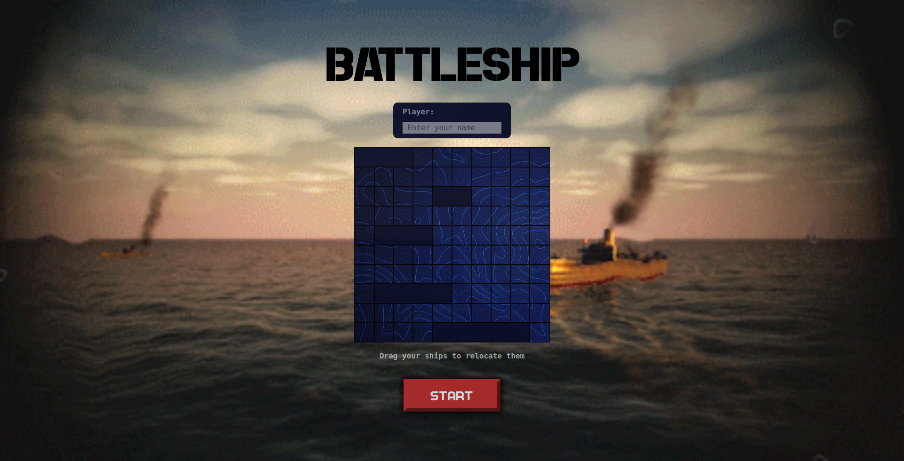
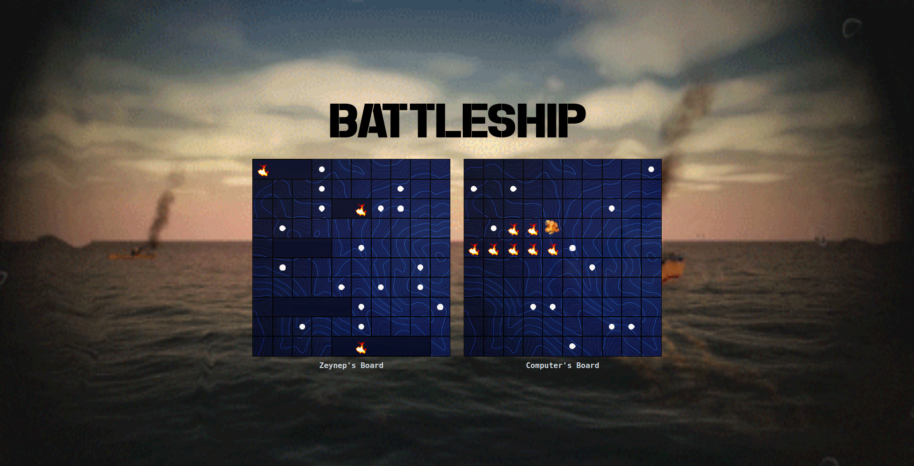
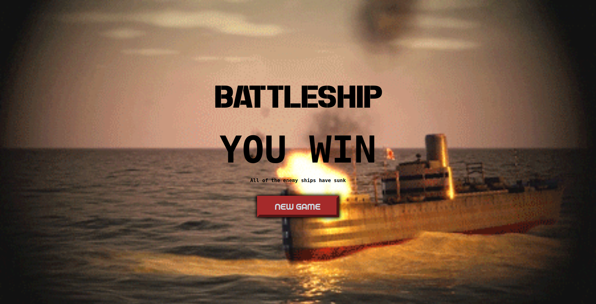
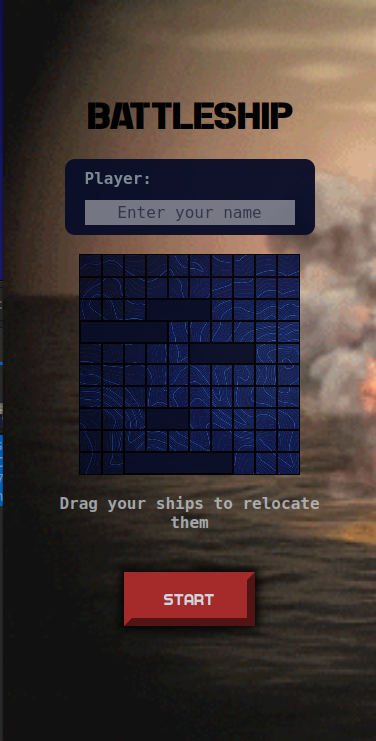
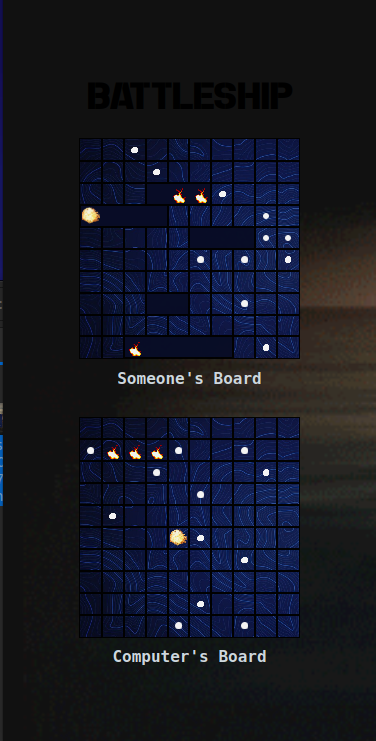
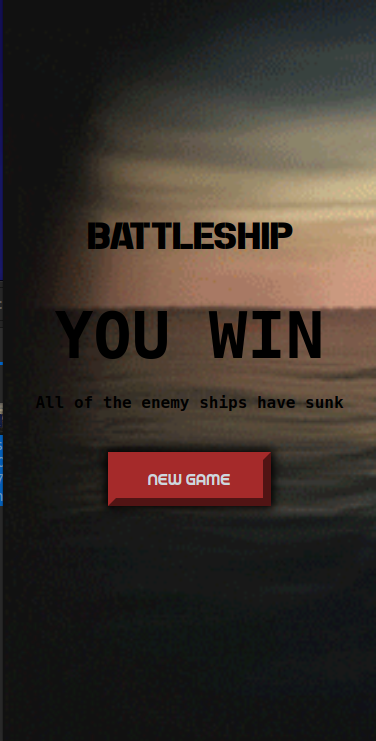

Battleship game made for [The Odin Project](https://www.theodinproject.com/)

- Game is played against the computer which makes random moves.
- Initially, ships are placed randomly. Player can drag & drop the ships(only available on desktop view at the moment) to relocate them.

# Desktop View

# Mobile View

